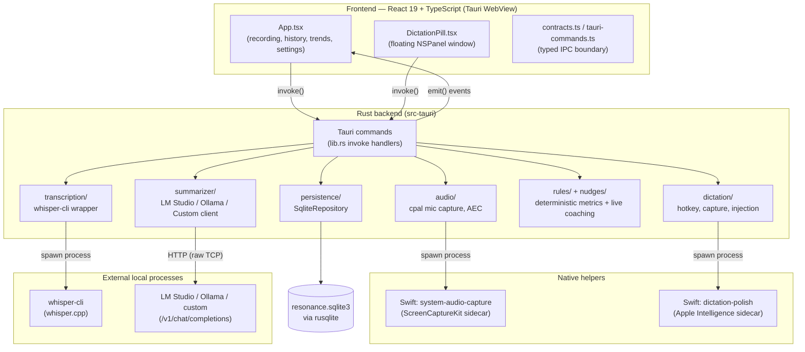
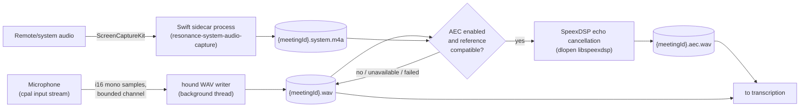
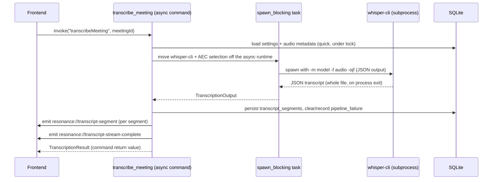
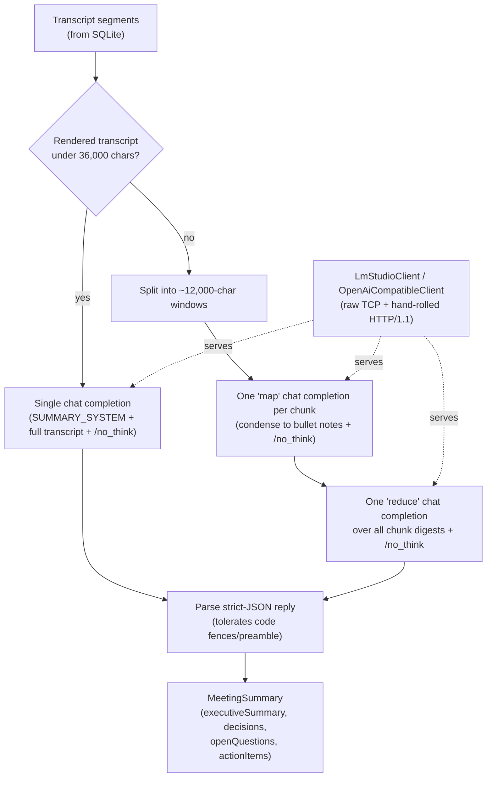
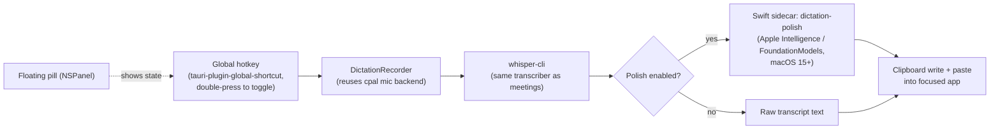

# Scribe — Technical Architecture

This doc explains how Scribe is built, why each major dependency was chosen,
and how the pieces fit together. It's aimed at whoever (human or agent) next
needs to change something here and wants the context that isn't obvious from
reading the code cold.

For the "why" behind specific architecturally significant decisions, this
doc points to ADRs in `docs/decisions/` rather than repeating their full
alternatives-considered reasoning inline. Read those when you need the full
story; read this doc for the map.

## 1. What Scribe is

A macOS desktop app (Tauri: React frontend + Rust backend) that:

1. Records a meeting's microphone audio and (optionally, separately) system/
   remote-participant audio.
2. Transcribes the recording locally with `whisper.cpp`.
3. Summarizes the transcript locally with an OpenAI-compatible chat model
   server (LM Studio by default, or Ollama, or any custom endpoint).
4. Surfaces live, deterministic (non-LLM) coaching nudges while a transcript
   replays.
5. Separately, offers system-wide dictation: a global hotkey captures speech,
   transcribes it, optionally polishes it with on-device Apple Intelligence,
   and pastes it into whatever app had focus.

Everything above runs on the user's Mac. No network calls are made except to
`127.0.0.1`-bound local model servers the user installs themselves. There is
no cloud fallback path currently wired up (an earlier product direction
explored one; see §11).

Internally the project is still named **Resonance** in a lot of places
(crate name, app-data folder, bundle identifier `com.resonance.meetingcoach`,
one of the two Swift sidecar binary names). The user-facing brand is
**Scribe**. Both names are correct depending on which layer you're looking
at — this isn't a half-finished rename, it's just been left alone because
renaming an app-data identifier has real migration cost (see the legacy
`rewrite_app_data_file_paths` path in `lib.rs`, a leftover from an even
earlier rename, Orator → Resonance).

## 2. System architecture

**IPC shape**: the frontend never talks to Rust directly except through two
channels — `invoke()` for request/response commands, and `emit()`/`listen()`
for one-way events (transcript segments streaming in, live nudges, etc). See
§9 for the full command/event surface.

## 3. Why Tauri (not Electron)

- Rust backend gets direct access to `cpal` (audio), `rusqlite` (SQLite),
  and process-spawning for the native helpers and external tools, without an
  N-API/native-module bridge.
- Much smaller shipped binary and memory footprint than bundling Chromium —
  Tauri uses the OS's native WebView (WKWebView on macOS).
- Rust's ownership model matters here specifically because the app spawns
  and manages multiple concurrent OS-level resources (audio streams, child
  processes, TCP connections to local model servers) where use-after-free or
  data races would be easy to introduce in a less strict language.
- Trade-off accepted: WKWebView is less featureful/debuggable than a full
  Chromium devtools experience, and cross-platform behavior (this app is
  macOS-only anyway, so this doesn't bite yet).

## 4. Frontend

**Stack**: React 19 + TypeScript, Vite for dev/build, Biome for lint/format,
`@tauri-apps/api` for the `invoke`/`emit` bindings. No state management
library, no router, no component framework — plain `useState`/`useCallback`.

**File map**:

| File | Role |
| --- | --- |
| `src/App.tsx` | The entire UI. Recording controls, meeting history/detail, trends, settings, dictation stats. This is a single ~1600-line component tree, not split into `src/components/*` — an earlier version of this doc (and an earlier README) described a `src/components/` directory that no longer exists; the app was consolidated into `App.tsx` at some point and never split back out. Worth revisiting if this file keeps growing, but not urgent — React's re-render cost here is small (a handful of settings screens and lists, not a data-heavy app). |
| `src/DictationPill.tsx` | A second, tiny React entry point rendered into its own Tauri window — the floating dictation status pill (see §8). |
| `src/contracts.ts` | Hand-written TypeScript interfaces mirroring every `#[derive(Serialize)]` struct on the Rust side (`MeetingSummary`, `MeetingHistoryDetail`, etc). This is the actual type-safety boundary between frontend and backend — there's no codegen keeping these in sync, so a Rust DTO change requires a manual matching edit here. |
| `src/tauri-commands.ts` | One thin async wrapper per Tauri command, typed against `contracts.ts`. Nothing else in the frontend calls `invoke()` directly. |
| `src/summary-clipboard.ts` | Builds the HTML + plain-text clipboard payload for the "Copy" button on generated notes — deliberately bullet lists and bold labels, no tables, so it pastes cleanly into Slack/Teams. |
| `src/format.ts`, `src/error-utils.ts` | Small formatting/error-message helpers. |

## 5. Audio capture

- **`cpal = "=0.17.1"`** (pinned, not a range) — low-level, cross-platform
  audio callback API. Pinned because audio callback APIs are exactly the
  kind of dependency where a minor-version behavior change (buffer sizing,
  callback timing) can introduce audio glitches that are painful to
  diagnose; a pin makes upgrades a deliberate, tested action instead of an
  incidental one.
- Samples flow from the real-time audio callback into a **bounded**
  `sync_channel` (capacity: 5 seconds of 48kHz mono samples). If the writer
  thread falls behind, new samples are **dropped and counted**
  (`dropped_sample_count`) rather than the channel growing unbounded — an
  audio callback that blocks or allocates unboundedly risks glitching the
  whole OS audio pipeline, so backpressure has to fail towards dropping data
  with a visible counter, not towards blocking.
- **`hound = "3.5.1"`** writes the mono 16-bit PCM WAV file incrementally on
  a background thread as samples arrive, so recording length isn't bounded
  by available RAM.
- **System audio** is NOT captured in Rust — ScreenCaptureKit is a
  Swift/Apple-framework API with no first-class Rust binding, so it's a
  small Swift sidecar process (`native/system-audio-capture/main.swift`),
  spawned and stopped (via stdin) by the Rust `RecordingManager`. See
  **ADR-001** for the full reasoning (direct FFI and virtual-driver
  alternatives were considered and rejected).
- **Echo cancellation** is optional and best-effort: `SpeexEchoCancellationBackend`
  `dlopen`s `libspeexdsp.dylib` at runtime rather than linking it at build
  time, so the app still builds and runs on machines without SpeexDSP
  installed. If AEC is disabled, unavailable, or fails for any reason,
  transcription falls back to the raw mic WAV — recording and transcription
  never block on AEC. See **ADR-002**.
- A **denied Screen Recording permission does not fail the whole recording** —
  `RecordingManager::start_recording` catches the system-audio start
  failure and falls back to mic-only, storing the reason in
  `system_audio_stream_error` on the meeting's metadata instead of
  propagating an error up through `?`. (This used to abort the entire
  recording — see the fixed-bugs note in `docs/distributing.md`'s history if
  you're wondering why this is called out.)

## 6. Transcription

- **`whisper-cli` is an external binary, not a linked Rust crate.** This
  keeps the whisper.cpp build (and its hardware-specific acceleration —
  Metal, CoreML, etc.) entirely out of Scribe's own build, and lets a user
  swap in whichever whisper.cpp build/model suits their machine without
  recompiling Scribe. The trade-off is a runtime dependency the app has to
  detect (`path_detection.rs` checks common Homebrew paths, then `$PATH`)
  and validate (binary is executable, model file exists, absolute paths
  only).
- `WhisperShellTranscriber::transcribe` shells out with `-ojf` (JSON output
  to file), then parses that JSON (`parse_whisper_json`) into
  `TranscriptSegment`s with millisecond offsets, rejecting non-monotonic
  offsets as a defensive check against a malformed whisper-cli build.
- **Retry-once**: `transcribe_audio_with_retry` retries a single time on any
  failure before giving up — cheap insurance against a transient spawn
  failure, not a substitute for validating whisper-cli/model paths up front.
- **The command runs off the async runtime** (`tauri::async_runtime::spawn_blocking`),
  because whisper-cli on a long recording can run for as long as the
  meeting itself. Originally this command was synchronous and the frontend
  `await`ed it directly after `stopRecording()` — stopping an 81-minute
  meeting meant staring at a spinner for however long transcription took,
  with zero progress feedback, because the batch JSON output only arrives
  once whisper-cli exits. The fix has two parts:
  - Backend: run the whisper-cli + AEC work inside `spawn_blocking` so the
    Tauri command doesn't tie up the invoke-handling thread pool for the
    whole run.
  - Frontend: `handleStop` in `App.tsx` no longer awaits transcription — it
    stops the recording, returns control immediately, and transcribes in
    the background (tracked per-meeting-id so the UI can show
    "Transcribing…" against just that item), firing a completion
    notification (`send_completion_notification`) when done.
- **Streaming replay, not true streaming transcription**: despite the
  `StreamingTranscriber`/`TranscriptEventSink` traits existing, the actual
  whisper-cli integration is batch — `BatchReplayStreamingTranscriber`
  wraps any batch `Transcriber` and replays its full output as a sequence of
  "final" events after the fact. This is why the UI shows all transcript
  segments appear at once rather than trickling in during whisper-cli's
  run. A genuinely incremental transcriber (parsing whisper-cli's stdout
  as it produces segments, rather than only its final JSON file) would let
  the UI show real progress instead of just a spinner, and is the natural
  next step if transcription latency remains a UX problem after the
  background-run fix above. Not done yet because it requires either a
  whisper-cli invocation mode that streams partial results to stdout, or an
  in-process whisper.cpp binding — both bigger changes than the async fix.
- **Detail-view transcript limit**: `get_meeting_history_detail` caps the
  transcript segments it returns to `HISTORY_DETAIL_TRANSCRIPT_LIMIT`
  (currently 5000; was 200, which silently cut off any meeting past ~45
  minutes with a `transcriptTruncated` flag the UI barely surfaced). This is
  a display cap, not data loss — the full transcript is always persisted;
  only the detail view's render is capped, to bound worst-case DOM size for
  pathologically long meetings.

## 7. Summarization

- **Generic OpenAI-compatible client, not an LM-Studio-only integration.**
  `SummarizerProvider` (`LmStudio | Ollama | Custom`) picks between
  `LmStudioClient` (which also drives the `lms` CLI to start/load/unload the
  server and model — see `LmStudioLifecycle`) and `OpenAiCompatibleClient`
  (a thin HTTP client for anything else, including Ollama's
  OpenAI-compatible endpoint). Both implement one `ChatCompletion` trait, so
  the actual summarization logic (`LmStudioSummarizer`) doesn't know or care
  which server it's talking to. This avoids locking users into one local
  LLM runtime.
- **Raw TCP, not `reqwest`.** `summarizer/mod.rs` opens a `TcpStream` and
  writes a hand-framed HTTP/1.1 request itself (`post`/`get`/`send_request`),
  parsing status line, headers, and chunked-transfer-encoding by hand. This
  keeps the dependency list free of an HTTP client crate (and its own
  transitive dependency tree) for what is, in practice, always a
  `127.0.0.1` loopback call to a local model server — there's no need for
  TLS, redirects, cookies, or any of what a general HTTP client buys you.
- **Map-reduce chunking** kicks in once the rendered transcript exceeds
  `SINGLE_SHOT_CHAR_BUDGET` (36,000 chars, roughly 9k tokens) — chunks of
  `CHUNK_CHAR_TARGET` (12,000 chars) are condensed individually, then
  combined in one final reduce call. Both single-shot and reduce prompts
  demand one strict JSON object matching a fixed schema; `parse_summary`
  tolerates code fences and preamble text a chatty model might add around
  the JSON.
- **Default model, sizing, and the timeout failure mode** — see
  **ADR-003** for the full story, including a real production incident:
  the previous default (a 26B model) reliably failed on a real 81-minute
  meeting because it was too slow for the hardware to finish a map/reduce
  call inside the 600-second per-request timeout, surfacing as
  `summarizer_unavailable` / `os error 35` (EAGAIN — the client's own read
  timeout firing, not a real connectivity problem). The current default is
  **Qwen3-14B, MLX 4-bit quantized** (reported by LM Studio as
  `qwen3-14b-mlx`), sized for a 36GB Apple Silicon Mac, with a `/no_think`
  directive appended to every prompt to skip Qwen3's default hidden
  reasoning pass (pure latency overhead for a deterministic extraction
  task). If you're packaging Scribe for lower-RAM machines, size down
  (Qwen2.5-7B-Instruct or similar) rather than reuse this default as a
  universal constant — model choice is a hardware-dependent decision, not a
  fixed one.
- **Model lifecycle**: `LmStudioLifecycle` shells out to the `lms` CLI to
  start the server, load the configured model, and unload it after use —
  so a large model only occupies RAM while a summary is actually being
  produced, not for the app's entire lifetime.

## 8. Dictation

- **Capture reuses the same `cpal`-backed recorder** as meeting recording
  (`DictationRecorder<CpalCaptureBackend>`), and the same
  `WhisperShellTranscriber` for transcription — dictation isn't a
  parallel, separately-maintained pipeline.
- **Injection is clipboard-paste, not an Accessibility text-insertion API.**
  Broadly compatible across arbitrary target apps (anything that accepts
  paste) without needing per-app integration; the cost is a brief clipboard
  overwrite, which the injection code is careful to sequence correctly
  (write clipboard, then simulate paste, hiding the pill window first so
  focus doesn't bounce to Scribe instead of the target app).
- **Apple Intelligence polish is optional and degrades silently.** The
  `dictation-polish` Swift sidecar uses `FoundationModels`, available macOS
  15+; on older macOS or when the on-device model isn't ready, it exits
  with a distinct code (2) that the Rust side treats as "use the raw
  transcript" rather than an error.
- **The floating pill is an `NSPanel`, not a normal Tauri window** —
  specifically so that clicking it (to see status, or its mic/polish
  controls) never activates Scribe or steals focus from whatever app the
  user was dictating into. `tauri-nspanel` (macOS-only Cargo dependency)
  converts the window at runtime. Getting the interaction right required
  care around *when* focus changes relative to the paste action (hide the
  panel, then paste — not the other way around), since a visible NSPanel
  briefly grabbing key focus mid-paste would insert the text into Scribe's
  own window instead of the target app.
- **Hotkey detection is double-press, not press-and-hold** (`DictationHotkey`
  tracks press timing to distinguish a deliberate double-tap from an
  incidental single press) — modeled on the Wispr Flow interaction pattern,
  since a single global hotkey with no visual "recording" affordance needs a
  very deliberate trigger gesture to avoid accidental activation.
- **Dictation sessions store stats only, not transcript text**
  (`dictation_sessions` table) — word count, duration, whether polish was
  used — by design, since dictated text is often much more sensitive/
  ephemeral (passwords typed via dictation, personal messages) than meeting
  transcripts, and there's no product need to keep the text around after
  it's been pasted.

## 9. Deterministic metrics and live nudges

Two small, deliberately non-LLM modules:

- **`rules/`** — pure functions over transcript segments. Tokenizes text,
  counts filler words (`um`, `uh`, `like`) and hedging phrases (`i think`,
  `kind of`, and similar), computes words-per-minute, total talk time, and
  longest monologue. No state, no I/O — `calculate_metrics(segments) ->
  MetricsSummary`.
- **`nudges/`** — `LiveNudgePipeline` layers throttled live feedback on top
  of the transcript replay stream (`NudgeTranscriptEventSink` composes it
  with `TauriTranscriptEventSink`): filler-word/hedging detection, pace
  outside 110-180 WPM, monologues over 45s. Each category is throttled
  independently (default 30s) plus a wall-clock minimum gap (1.5s) so nudges
  don't spam as segments replay quickly.

**Why rule-based instead of asking the local LLM for live feedback**: this
needs to be instant and deterministic — it fires while a transcript is
replaying, not after a multi-second model round trip, and it shouldn't
depend on whether a model server happens to be running. Reserve the LLM
call (§7) for the one thing rules genuinely can't do well: synthesizing an
executive summary and extracting decisions/action items from free text.

## 10. Persistence

- **`rusqlite` directly, no ORM.** `SqliteRepository` hand-writes every
  query with `params![]` bound parameters — appropriate for a single-user,
  fully local, embedded dataset where an ORM's main value (managing a
  shared multi-user schema across a network boundary) doesn't apply, and
  where the schema is small enough that hand-written SQL stays readable.
- **Schema versioning**: a `schema_versions` table tracks applied
  migrations (`run_migrations`, currently at version 15); `ensure_column`
  validates column names/types against a static allow-list before
  formatting any DDL string, since SQLite's `ALTER TABLE ADD COLUMN` can't
  be parameterized the way row-level queries can.
- **Live tables** (actually read/written by shipped features): `meetings`,
  `transcript_segments`, `metrics`, `reports`, `meeting_summaries`,
  `audio_metadata`, `settings`, `pipeline_failures`, `dictation_sessions`,
  `schema_versions`.
- **Schema-only tables** (exist, have no CRUD methods or reachable command
  wired to them): `practice_recordings`, `practice_review_reports`,
  `practice_timeline_annotations`, `voice_profiles`. See §11.
- **Retention**: a background job removes raw audio files older than the
  configured retention window (`rawAudioRetentionDays`), while keeping
  transcripts/notes indefinitely — audio is the bulky, re-derivable
  artifact; transcripts and notes are the durable value.

## 11. Known dead code and unshipped features

Documenting this honestly matters more than it might seem — without it, the
schema-only tables and feature-gated code below look like bugs or
half-finished work-in-progress to the next person (or agent) who finds them,
when really they're a deliberate, paused product direction.

| Item | Status | Where |
| --- | --- | --- |
| **`analysis::OllamaAnalyzer`** (post-meeting coaching scorecard) | Dead code. Superseded by the generic `summarizer` provider path (§7); the `MeetingSummarizer` trait it implements is still used, but nothing calls `OllamaAnalyzer` itself. `run_blocking_ollama_summary` and `ensure_analysis_provider_available` are `#[allow(dead_code)]`. | `src-tauri/src/analysis/` |
| **Record and Review** (practice video recording/import, local review report) | Schema exists (`practice_recordings`, `practice_review_reports`, `practice_timeline_annotations`), and some backend plumbing (`media_import.rs` has `copy_practice_video`/`extract_practice_video_audio`), but there is no Tauri command wired to any of it and no frontend view. Original spec: `docs/record-and-review-plan.md`. | `src-tauri/src/media_import.rs`, `docs/record-and-review-plan.md` |
| **Voice-matched coaching** (speaker enrollment, embeddings, diarization) | Schema-only (`voice_profiles` table, no CRUD methods). The `speaker-matching-sherpa` Cargo feature gates an optional `sherpa-onnx` dependency but is never enabled by default and nothing in the active command surface uses it. | `Cargo.toml` (`speaker-matching-sherpa` feature) |
| **Cloud video review** (sampled-frame review via OpenAI) | Absent from the current codebase — no `video_review.rs`, no OpenAI API wiring, no frame sampling. Referenced in `docs/ideas/meeting-coach.md` as original product intent. | `docs/ideas/meeting-coach.md` |

If reviving any of these, start from the linked plan/idea doc for the
original intent, but verify against current code — none of it has been kept
in sync with the Scribe-era pipeline (dictation, the generic summarizer
provider, the async transcription fix) described above.

## 12. Tauri command and event surface

All commands are registered in `lib.rs`'s `invoke_handler`. Grouped by area:

| Area | Commands |
| --- | --- |
| App/status | `get_app_status`, `check_permissions`, `open_permission_settings` |
| Recording | `list_audio_devices`, `start_recording`, `stop_recording` |
| Transcription/analysis | `transcribe_meeting`, `calculate_metrics`, `summarize_meeting` |
| History | `list_meeting_history`, `get_meeting_history_detail`, `delete_meeting`, `list_meeting_trends` |
| Dictation | `start_dictation`, `stop_dictation`, `toggle_dictation`, `list_dictation_sessions`, `delete_dictation_session`, `get_dictation_stats_summary`, `inject_dictation_text`, `polish_dictation`, `update_dictation_settings` |
| Settings | `update_summarizer_settings`, `list_summarizer_models`, `update_transcriber_settings`, `update_audio_processing_settings`, `update_privacy_settings` |
| Misc | `send_completion_notification` |

Events (one-way, `app.emit()` to frontend `listen()`):

- `resonance://transcript-segment` — one per transcript segment, emitted
  during transcript replay (see §6; despite the name suggesting live
  streaming, these currently all fire in a burst once whisper-cli's full
  output is ready).
- `resonance://transcript-stream-complete` — end-of-replay marker, includes
  segment count and any dropped-event count from the bounded event sink.
- `resonance://live-nudge` — one per nudge from `LiveNudgePipeline` (§9).

**The `spawn_blocking` pattern**: any command that does real, possibly
long-running work outside pure DB reads/writes — `transcribe_meeting`
(whisper-cli + AEC), `summarize_meeting` (LM Studio/Ollama HTTP calls +
model load/unload), `inject_dictation_text` and `polish_dictation`
(spawning `pbcopy`/`osascript`/the polish sidecar) — is an `async fn`
command that moves the blocking work into
`tauri::async_runtime::spawn_blocking`, re-acquiring any repository locks
only before/after the blocking section, never across it. This is a
deliberate, repeated pattern: **new commands that shell out to a subprocess
or make a network call should follow it too**, rather than doing that work
directly in a synchronous command body.

## 13. Build and packaging

- **Frontend**: Vite builds `src/` to `dist/`, which Tauri's bundler embeds.
- **Swift sidecars**: `src-tauri/build.rs` compiles both
  `native/system-audio-capture/main.swift` and
  `native/dictation-polish/main.swift` via `xcrun swiftc -parse-as-library -O`
  into `src-tauri/binaries/<name>-<target>`, skipping recompilation if the
  output is already newer than the source. `tauri.conf.json`'s
  `bundle.externalBin` lists both so Tauri copies the right target's binary
  into the app bundle.
- **Signing**: ad-hoc signed only (Tauri's default when no `signingIdentity`
  is set) — no Apple Developer ID yet. This has a real, recurring cost: see
  the README's "Building and installing a distributable build" section for
  the day-to-day workaround, and the note below for why it hasn't been
  fixed properly yet.
- **A self-signing attempt was tried and abandoned**: a self-signed
  "Scribe Local Dev" code-signing certificate was generated and trusted in
  the login keychain, but `codesign -s "Scribe Local Dev"` failed with
  `errSecInternalComponent` (suspected login-keychain password out of sync
  with the account password after a password reset). If revisited: try
  resetting the login keychain password to match the account password
  first. The real fix is an Apple Developer ID + notarization
  (`docs/distributing.md`'s "Upgrading to notarized builds later" section
  has the concrete steps) — self-signing only gets a locally-consistent
  signature hash across rebuilds, it doesn't satisfy Gatekeeper on other
  machines the way notarization does.
- **Packaging scripts**: `bun run package:mac` (`.app` only) and
  `bun run package:mac:dmg` (`.dmg`, what you'd hand to a teammate).

## 14. Dependency reference

### Rust (`src-tauri/Cargo.toml`)

| Crate | Why |
| --- | --- |
| `tauri` (`macos-private-api`, `tray-icon`, `image-png` features) | App shell, window management, tray icon, IPC. `macos-private-api` is needed for the NSPanel dictation pill conversion. |
| `tauri-plugin-global-shortcut` | System-wide dictation hotkey registration, independent of window focus. |
| `tauri-nspanel` (macOS-only, git dependency) | Converts the dictation pill's window into a non-activating `NSPanel` at runtime — not available as a published crate at the version needed, hence the git dependency pinned to the `v2` branch. |
| `cpal` (pinned `=0.17.1`) | Cross-platform low-level audio input callback API — mic capture and dictation capture both go through it. |
| `hound` | WAV file reading/writing (PCM 16-bit mono), used for mic recordings, AEC input/output, and dictation capture. |
| `rusqlite` | Embedded SQLite driver — all persistence. No ORM (see §10). |
| `serde` / `serde_json` | (De)serialization for Tauri command DTOs, whisper-cli's JSON output, and the summarizer's chat-completion JSON. |
| `tempfile` | Scratch directories for whisper-cli's JSON output and AEC intermediates. |
| `sherpa-onnx` (optional, `speaker-matching-sherpa` feature) | ONNX runtime bindings for the never-enabled-by-default voice-matching feature (§11). Feature-gated specifically so normal builds don't pull in ONNX Runtime's native binary. |
| `tauri-build` (build-dependency) | Tauri's code-generation step; also where `build.rs` hooks in the Swift sidecar compilation. |

No HTTP client crate (`reqwest` etc.) — the summarizer hand-rolls HTTP/1.1
over a raw `TcpStream` (§7). No async runtime crate beyond what Tauri
already pulls in — `tauri::async_runtime::spawn_blocking` is used directly.

### Frontend (`package.json`)

| Package | Why |
| --- | --- |
| `react` / `react-dom` (v19) | UI framework. |
| `@tauri-apps/api` | `invoke`/`emit`/`listen` bindings into the Rust backend. |
| `vite` + `@vitejs/plugin-react` | Dev server (HMR) and production bundling. |
| `typescript` | Static typing across the whole frontend, including the hand-written IPC contracts in `contracts.ts`. |
| `@biomejs/biome` | Combined linter + formatter (replaces ESLint + Prettier with one faster tool). |
| `@tauri-apps/cli` | `tauri dev` / `tauri build` commands. |

## 15. Testing and verification

- **Rust**: `cargo test` (150+ tests) covers domain logic, parsing (whisper
  JSON, chat-completion responses), the recording manager's fallback
  behavior, persistence round-trips, and the map-reduce chunking logic. A
  handful of tests are `#[ignore]`d because they need real hardware/local
  services (`whisper-cli` + a model, a running LM Studio, Accessibility
  permission) — run them manually when touching those paths.
- **Frontend**: `bun test tests/frontend` for component/utility tests;
  `tsc --noEmit` for type-checking; `biome check` for lint/format.
- **No end-to-end test harness.** The Tauri backend requires the native
  app shell — Vite's dev server alone (`bun run dev`) can render the
  frontend, but `isTauriRuntime()` is false there, so none of the actual
  `invoke()` calls reach real Rust commands. Verifying a change to the
  record/transcribe/summarize pipeline means running the actual built app
  (`bun run tauri dev`, or a packaged build), not just the web preview.

## Further reading

- `docs/decisions/adr-001-system-audio-sidecar.md` — why a Swift sidecar for system audio, not FFI or a virtual driver.
- `docs/decisions/adr-002-offline-aec-adapter.md` — why offline SpeexDSP AEC, dlopen'd rather than linked.
- `docs/decisions/adr-003-summarizer-model-and-timeout.md` — the 26B-model timeout incident, and why the default model/timeout/`/no_think` are set the way they are.
- `docs/record-and-review-plan.md`, `docs/ideas/meeting-coach.md` — original product direction for the unshipped features in §11.
- `docs/distributing.md` — the team-facing version of the ad-hoc-signing workaround.
